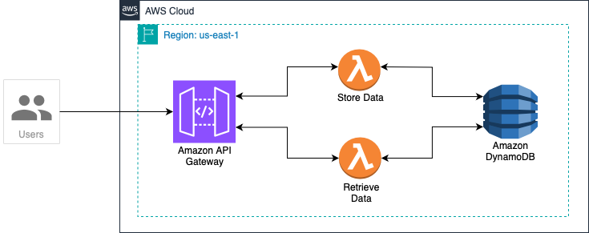

# Serverless Applications with Lambda using Terraform

<p align="center">

</p>

## Introduction

In this project, we will leverage Terraform to build a serverless application architecture on AWS. This architecture is structured to harness the benefits of serverless computing, ensuring efficient scalability and cost-effectiveness.

1. Compute Layer: At the core of this architecture are AWS Lambda functions. These functions are event-driven and execute code in response to various triggers, such as HTTP requests via API Gateway. 

2. Presentation Layer: API Gateway serves as the entry point for external requests. It routes incoming HTTP requests to the corresponding Lambda functions, enabling seamless interaction between clients and the application background.

3. Data Layer: DynamoDB serves as the data layer, offering a fully managed NoSQL database solution. It stores and retrieves data accessed by the Lambda functions, ensuring high availability and low latency for data-intensive operations.

<br/>

## Terraform Configuration Files

1. **api_gateway.tf**: Configuration of API Gateway including resources, methods and integrations
    * aws_api_gateway_rest_api
    * aws_api_gateway_resource
    * aws_api_gateway_method
    * aws_api_gateway_integration

2. **dynamodb.tf**: Contains DynamoDB table resource
    * aws_dynamodb_table

3. **iam.tf**: Configuration of IAM roles and policies
    * aws_iam_role	 

4. **lambda.tf**: Configuration of Lambda functions and permissions
    * aws_lambda_function
    * aws_lambda_permission

5. **outputs.tf**: Define the outputs you want to display after Terraform applies changes
    * dynamodb_table_name
    * lambda_function_names
    * **api_gateway_url**: This output provides the publicly accessible URL that clients can use to access your API Gateway endpoints.
      
<br>

## Python Scripts

1. **store_data_function.zip**: Contains the deployment package for the ‘StoreDataFunction’ Lambda function. It includes the Python script (‘store_data.py’) which manages incoming requests, interacts with DynamoDB to store data, constructs responses, and generates a unique UUID for each stored data entry. This UUID serves as a key to retrieve the stored data later.    

2. **retrieve_data_function.zip**: Contains the deployment package for the ‘RetrieveDataFunction’ Lambda function. It includes the Python script (‘retrieve_data.py’) which retrieves data from DynamoDB based on the provided item ID. It utilizes the item ID, which corresponds to the UUID generated by the StoreDataFunction, to efficiently fetch the stored data.

<br/>

## Calling the API endpoints

1. Store Data (POST /data)
```
curl -X POST https://<API_ID>.execute-api.<region>.amazonaws.com/prod/data \
     -H "Content-Type: application/json" \
     -d '{"data": "Your data payload here"}'
```
2. Retrieve Data (GET /data/{id})
```
curl -X GET https://<API_ID>.execute-api.<region>.amazonaws.com/prod/data/<id>
```


  
